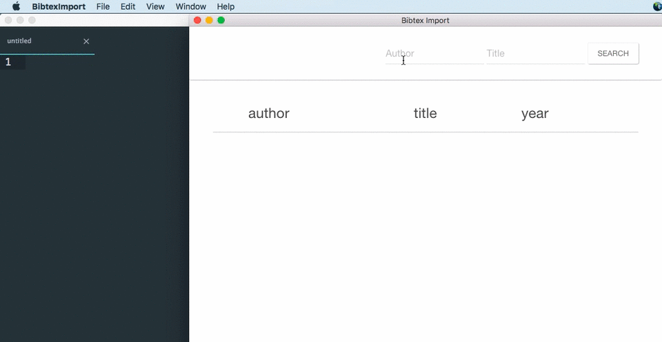

# Bibtex Import

*Bibtex Import* is an app that lets users get Bibtex references from [MathSciNet](http://www.ams.org/mathscinet/index.html).

**You need a MathSciNet subscription or access in order to use this software**

It is written in [CoffeeScript](http://coffeescript.org) and built using [Electron](http://electron.atom.io) and [Node.js](https://nodejs.org/)

Usage
=====

Enter the author and title in the fields. You can also use wildcards and boolean operators, see [here](http://www.ams.org/mathscinet/help/full_search_help_full.html) for details. You may also leave one of the fields empty.

Press search or hit ENTER. The results of the search will appear on the table. You can click on an entry to select it, you can also use `Edit>Select All` to toggle selecting all the entries. Next use `Edit>Copy` to copy the selected bibtex entries to clipboard. You can paste these into an editor.

Todo
====
- [ ] Include support for [remote access](http://www.ams.org/publications/remoteaccess)
- [ ] Set up auto-updates
